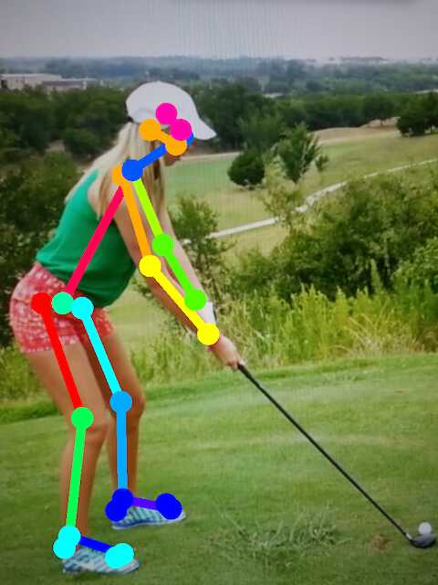
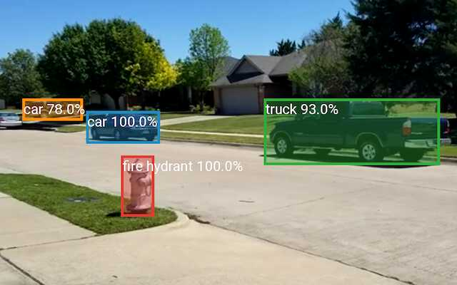

# MobiledgeX Computer Vision Server REST API

## Face Detection
`/detector/detect/`

Used to send a face image to the server and get back a set of coordinates for any detected faces.

### POST
`http://<hostname>:8008/detector/detect/`

#### Parameters
| Parameter | Description |
| - | - |
| image | The face(s) image. |

#### Return
JSON string with the following attributes.

| Attribute | Description |
| - | - |
| success | "True" if face detected, otherwise "false". |
| server_processing_time | The time in milliseconds that it took the server to process this image. |
| rects | A JSON array of coordinates containing the detected faces. Only included if "success"="true". |

#### Examples:
##### Single face detected:
```
curl http://facedetection.defaultedge.mobiledgex.net:8008/detector/detect/ -F "image=@Bruce.jpg"
{"success": "true", "server_processing_time": "19.873", "rects": [[73, 76, 147, 150]]}
```

##### Multiple faces detected:
```
curl http://facedetection.defaultedge.mobiledgex.net:8008/detector/detect/ -F "image=@face_triple.jpg"
{"success": "true", "server_processing_time": "30.898", "rects": [[6, 104, 59, 157], [68, 165, 138, 235], [120, 28, 189, 97]]}
```

##### No faces detected:
```
curl http://facedetection.defaultedge.mobiledgex.net:8008/detector/detect/ -F "image=@single_pixel.png"
{"success": "false", "server_processing_time": "0.030"}
```

## Face Recognition
`/recognizer/predict/`

Used to send a face image to the server and get back a set of coordinates for the recognized face, along with a "subject" name value if the face is recognized against the current trained data.

_Note: This call is limited to a single face. At training time, no images are added to the set if more than one face is detected. If more than one face is present in an image for this call, prediction will only be performed on the first face detected._

### POST
```
http://<hostname>:8008/recognizer/predict/
```

#### Parameters
| Parameter | Description |
| - | - |
| image | The face image. |

#### Return
JSON string with a "success" value of "true" or "false", and if successful, the following JSON values:

| Attribute | Description |
| - | - |
| success | "True" if face recognized, otherwise "false". |
| subject | Name of detected face. |
| confidence | Level of confidence. Actually a measure of distance the features are from matching a given subject. Lower is better, with 0 being a perfect match. |
| rect | Coordinates of detected face. |
| server_processing_time | Time in milliseconds that it took the server to process this image. |

_Note: This call will return subject names even with very poor (high distance) confidence values. It is up to the caller to decide what it considers a good prediction. For instance in the [MobiledgeX SDK Demo app](https://play.google.com/store/apps/details?id=com.mobiledgex.sdkdemo), the *RECOGNITION_CONFIDENCE_THRESHOLD* value is 105, which means that any image with a confidence value higher than that will be shown with a subject name of "Unknown"._

#### Examples:
##### Face detected and recognized:
```
curl facedetection.defaultedge.mobiledgex.net:8008/recognizer/predict/ -F "image=@Bruce.jpg"
{"success": "true", "subject": "Bruce Armstrong", "confidence": "71.850", "server_processing_time": "48.218, "rect": [73, 78, 146, 151]}
```

##### Face not detected:
```
curl facedetection.defaultedge.mobiledgex.net:8008/recognizer/predict/ -F "image=@single_pixel.png"
{"success": "false", "server_processing_time": "0.082"}
```
##### Training data update in progress:
```
curl facedetection.defaultedge.mobiledgex.net:8008/recognizer/predict/ -F "image=@Bruce.jpg"
<HTTP/1.1 503 Service Unavailable>
Training data update in progress
```
If this state is encountered, it should only last a few seconds.

## Pose Detection
`/openpose/detect`

Used to send an image with one or more human bodies to the server and get back a set of coordinates for any detected poses. In the our implementation, pose detection requires a GPU in order to run. If the server executing this call does not have GPU support, a `501 Not Implemented` response will be returned along with the message "OpenPose not supported on this server".

### POST
```
http://<hostname>:8008/openpose/detect/
```

#### Parameters
| Parameter | Description |
| - | - |
| image | The body/bodies image. |

#### Return
JSON string with the following attributes.

| Attribute | Description |
| - | - |
| success | "True" if pose detected, otherwise "false". |
| server_processing_time | The time in milliseconds that it took the server to process this image. |
| poses | A JSON array of coordinates containing the detected poses. Only included if "success"="true". |


#### Examples:

##### No GPU Support:
```
curl -v http://facedetection.defaultedge.mobiledgex.net:8008/openpose/detect/ -F "image=@6_bodies.jpg"
<HTTP/1.1 501 Not Implemented>
OpenPose not supported on this server
```

##### Single body detected:
```
curl http://posedetection.defaultedge.mobiledgex.net:8008/openpose/detect/ -F "image=@HollyGolfPose.jpg"
{"success": "true", "server_processing_time": "35.358", "poses": [[[81.44993591308594,
60.397254943847656, 0.8385379910469055], [62.35408401489258, 71.56185150146484,
0.7587199807167053], [57.761253356933594, 72.89726257324219, 0.7079280018806458],
[70.91712951660156, 109.7353744506836, 0.8329359889030457], [91.94576263427734,
132.76388549804688, 0.7801129817962646], [66.98677062988281, 70.2525863647461,
0.6113029718399048], [76.14794158935547, 98.54723358154297, 0.7279360294342041],
[88.695068359375, 126.8495864868164, 0.5476869940757751], [37.99922561645508,
119.61351776123047, 0.6892729997634888], [29.478424072265625, 118.96443939208984,
0.6695190072059631], [45.24222183227539, 161.7540740966797, 0.8158119916915894],
[39.353736877441406, 208.4813995361328, 0.8047149777412415], [44.604549407958984,
120.9274673461914, 0.6877480149269104], [59.73560333251953, 156.47828674316406,
0.8010519742965698], [59.70419692993164, 193.97427368164062, 0.787992000579834],
[79.45913696289062, 55.804908752441406, 0.7655370235443115], [82.77788543701172,
56.42868423461914, 0.13575899600982666], [70.23596954345703, 54.46745300292969,
0.700311005115509], [0.0, 0.0, 0.0], [76.19108581542969, 197.28915405273438,
0.7914149761199951], [74.8634033203125, 195.9574737548828, 0.6512309908866882],
[55.13571548461914, 197.95840454101562, 0.7731919884681702], [58.40681076049805,
213.73648071289062, 0.6830360293388367], [53.80148696899414, 215.69586181640625,
0.6367629766464233], [36.029396057128906, 213.71531677246094, 0.6915079951286316]]]}
```

We'll only show a single pose being recognized, as the amount of data returned for multiple poses can be quite large.

#### Response Details
Each value in the "poses" array is an x, y coordinate, followed by a confidence value. If more than one body is detected, multiple arrays of coordinates will be included in the response.

The received points represent the start or end of a “bone”, so they must be rendered as pairs. The “0.0” value means that particular segment was not detected.

##### Rendering Implementation for Android
The following Java arrays are used to render the received coordinates.
```
/**
* The pairs array is a 2D list of the body parts that should be connected together.
* E.g., 1 for "Neck", 2 for "RShoulder", etc.
* See https://github.com/CMU-Perceptual-Computing-Lab/openpose/blob/master/doc/output.md
*/
private int[][] pairs = {
       {1,8},{1,2},{1,5},{2,3},{3,4},{5,6},{6,7},{8,9},{9,10},{10,11},{8,12},
       {12,13},{13,14},{1,0},{0,15},{15,17},{0,16},{16,18},{14,19},
       {19,20},{14,21},{11,22},{22,23},{11,24}
};

/**
* Colors array corresponding to the "pairs" array above. For example, the first pair of
* coordinates {1,8} will be drawn with the first color in this array, "#ff0055".
*/
private String[] colors = {
       "#ff0055", "#ff0000", "#ff5500", "#ffaa00", "#ffff00", "#aaff00", "#55ff00", "#00ff00",
       "#ff0000", "#00ff55", "#00ffaa", "#00ffff", "#00aaff", "#0055ff", "#0000ff", "#ff00aa",
       "#aa00ff", "#ff00ff", "#5500ff", "#0000ff", "#0000ff", "#0000ff", "#00ffff", "#00ffff",
       "#00ffff"};
```

#### Example rendered output:



## Object Detection
`/object/detect/`

Used to send an image to the server and get back a set of coordinates and names for any detected objects. Unlike Pose Detection, which requires a GPU, object detection can be ran in CPU-only mode, though it will be considerably slower.

### POST
`http://<hostname>:8008/object/detect/`

#### Parameters
| Parameter | Description |
| - | - |
| image | The object(s) image. |

#### Return
JSON string with the following attributes.

| Attribute | Description |
| - | - |
| success | "True" if object(s) detected, otherwise "false". |
| server_processing_time | The time in milliseconds that it took the server to process this image. |
| gpu_support | Whether the server is using a GPU to accelerate image processing. |
| objects | A JSON array which may contain a nested JSON array with the following attributes: |
|  | `rect`: Coordinate of the object |
|  | `class`: Class name of the object, e.g. "ball", "dog", etc. |
|  | `confidence`: Confidence level that the object was identified correctly. Range is 0 to 1. |

#### Examples:
##### Single object detected:
```
curl http://posedetection.defaultedge.mobiledgex.net:8008/object/detect/ -F "image=@Bruce.jpg"
{"success": "true", "server_processing_time": "27.182", "gpu_support": true, "objects":
[{"rect": [1, 48, 203, 276], "class": "person", "confidence": "1.00"}]}
```

##### Multiple objects detected:
```
curl http://posedetection.defaultedge.mobiledgex.net:8008/object/detect/ -F "image=@objects_001.jpg"
{"success": "true", "server_processing_time": "28.584", "gpu_support": true, "objects":
[{"rect": [-1, 76, 112, 206], "class": "bicycle", "confidence": "1.00"}, {"rect": [57,
147, 106, 202], "class": "sports ball", "confidence": "0.92"}, {"rect": [92, 64, 165,
170], "class": "chair", "confidence": "0.99"}, {"rect": [137, 55, 179, 87], "class":
"laptop", "confidence": "0.98"}]}
```

##### No objects detected on non-GPU server:

```
curl http://facedetection.defaultedge.mobiledgex.net:8008/object/detect/ -F "image=@single_pixel.png"
{"success": "false", "server_processing_time": "3827.654", "gpu_support": false}
```

#### Example rendered output:

